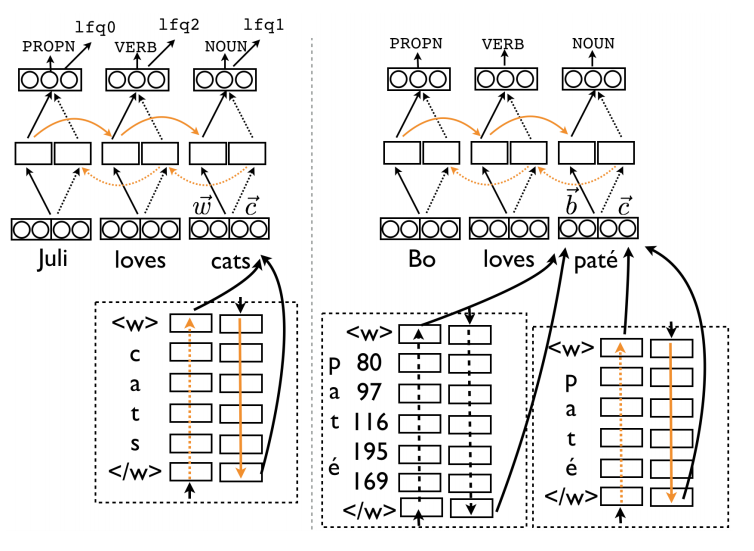

### Description
This project aims to reimplement the [Multilingual Part-of-Speech Tagging Model with
Bidirectional Long Short-Term Memory Models and Auxiliary Loss](https://arxiv.org/pdf/1604.05529.pdf) using pytorch.

### Library used
1. torch and torchvision
1. torchtext: Used to build vocab and alphabet
1. conllu: Used to parse conllu file
1. xmltodict: Load the stats.xml in each language repo
1. sklearn: Used the function metrics.accuracy_score for evaluation

### The model
The implemented model is a hierarchical bi-directional LSTM.

The model uses two level of embedding: word-level embedding and character-level embedding. character-level embedding is passed through a LSTM layer. The output of this layer will be concatenated with the word-level embedding to be used as the input for the upper bidirectional LSTM layer.

For instant, an input sentence of N words:
1. Char-level:
    1. Find the max_word_length among N words. Pad the words to all have length of max_word_length.
    1. After embedding layer, get tensor of size ```max_word_length x N x character_level_embedding_dim``` ```(batch_first=True)```
    1. After lower_LSTM layer, only take the last state and get tensor of size ```N x lower_LSTM_hidden_dim```
1. Word-level:
    1. Concatenate the character-level output and the output of word embedding to get ```N x (lower_LSTM_hidden_dim + word_embed_dim)```
1. Final layer: linear + log_softmax

Model architecture taken from the research paper:


The current implementation doesn't support mini-batch.

### The data
Multi-lingual tree banks, over 70 languages.
[Link](https://universaldependencies.org/#download)

The dataset can be download by running the ```.downloadData.sh``` bash script. This bash auto merge some of the dataset and cleaned up dataset that cannot be merged or need an extra step (E.g: Use Twitter API)

### Project Structure
1. Util: Contains different helper for the project
    1. data: Contains different helper for loading and processing the dataset:
        * ```get_languages```: Since a language can have multiple repo, I chosed the language with both train, dev, and test set with largest number of tokens (based on its correspondint 'stats.xml'). The languages and its repo will be cached in ```lang_to_dir.pkl``` in data directory.
        * ```LanguageDataset```: a customed language loader class to load a language. This class contains:
            * 3 splits of a dataset as SplitData Object
            * Meta data: Load from ```stats.xml``` file in each language repo
            * The dataset vocab, cached in a pkl file
            * The dataset alphabet, , cached in a pkl file
        * ```SplitData``` contains data of a specific split, cached in a pkl file:
            * conllu_contents: conllu content parsed using the [conllu parser lib](https://github.com/EmilStenstrom/conllu)
            * tokens: list of tokens for each sentences
            * tags: list of corresponding tags

    1. nlp: NLP Helper library
        * ```build_vocab_from_sentences_tokens```: used torchtext to build vocab from list of conllu loaded tokens
        * ```build_alphabet_from_sentences_tokens```: similarly, used torchtext to build alphabet from list of conllu loaded tokens

1. trainer: Perform training with some given configs. Including:
    1. Load dataset
    1. Logging, training, caching
    1. Evaluate

1. model: The implemented model
1. main: setup arguments and default configs

### Performance
TODO: Add graphs

Performance so far
1. French: 92.71 < 94.44 from the research paper
1. Italian: 90.37 < 96.57 from the research paper
1. Hebrew: 90.00 < 93.97 from the research paper
1. Germany: 85.14 < 90.33 from the research paper

However, the implementation is different from the research paper with 2 configs:
1. The research paper claims to use lr=0.1. Using lr=0.1 explode the loss. Hence use lr=0.0001 instead.
1. The implementation use Adam optimizer instead of SGD.

It's also possible that the paper use different dataset
